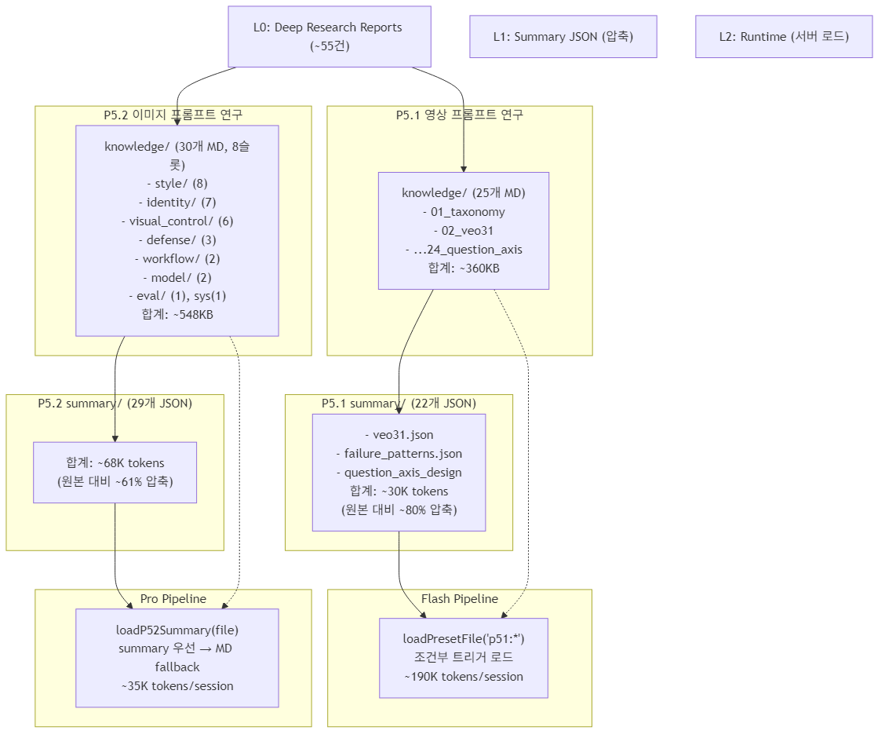
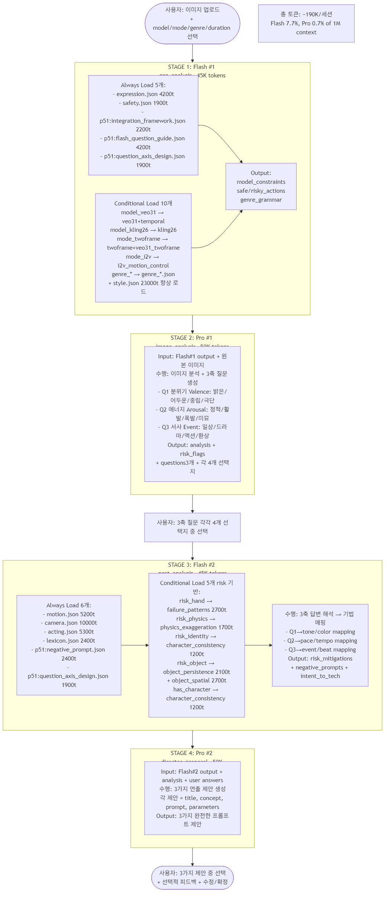
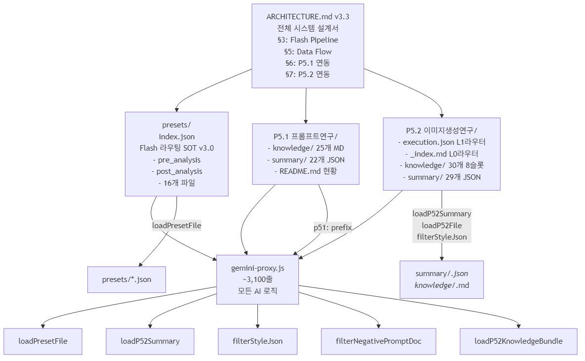
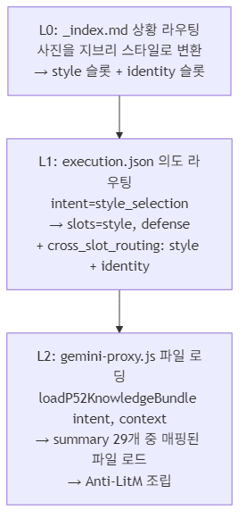
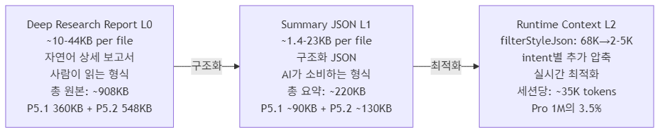

# Molt-Vision: AI 영상/이미지 프롬프트 자동 생성 플랫폼

## 서비스 소개 + 시스템 아키텍처 종합 문서

> **본 문서의 목적**: 이 파일 하나로 Molt-Vision의 서비스 가치, 기술 구조, 연구 자산을 완전히 이해할 수 있도록 설계되었습니다. 인포그래픽 제작, 사업 발표, 기술 심사 등에 활용할 수 있습니다.

---

## PART 1: 서비스 개요

### 한 줄 요약
**사진 한 장으로 전문가급 AI 영상/이미지 프롬프트를 자동 생성하는 서비스**

---

### 무엇을 하는 서비스인가

사용자가 **사진 한 장을 업로드**하면, AI가 그 사진을 분석하고 **3가지 질문**을 던집니다.
사용자가 원하는 분위기, 에너지, 서사를 선택하면 — AI가 **전문 영상감독 수준의 프롬프트 3가지를 제안**합니다.

이 프롬프트로 AI 영상(Veo, Kling 등)이나 AI 이미지(Gemini)를 생성할 수 있습니다.

---

### 왜 이것이 필요한가

AI 영상/이미지 생성 도구(Veo, Kling, Midjourney 등)는 강력하지만, **좋은 결과를 얻으려면 프롬프트 작성 능력이 필요**합니다.
- 조명, 카메라 앵글, 감정 표현, 스타일 참조 등 전문 영상 언어를 알아야 함
- 모델별로 먹히는 프롬프트가 다름 (Veo vs Kling vs Runway)
- 실패를 방지하는 네거티브 프롬프트 노하우가 별도로 필요

Molt-Vision은 **55건의 deep-research 연구 결과**를 AI에게 학습시켜, 사용자 대신 전문가급 프롬프트를 작성합니다.

---

### 어떻게 작동하는가

#### 영상 프롬프트 생성 (4단계)
```
사진 업로드 → [AI 분석] → 3축 질문 → [사용자 선택] → 감독급 프롬프트 3개 제안
```

1. **AI가 사진을 분석** — 표정, 포즈, 분위기, 위험 요소(손가락 오류 등) 파악
2. **3축 질문** — 분위기(밝은/어두운), 에너지(정적/활발), 서사(일상/드라마)
3. **사용자가 선택** — 각 질문에 4개 선택지 중 고르기
4. **AI가 3가지 연출 제안** — 카메라 워크, 조명, 모션, 네거티브 프롬프트까지 포함

#### 이미지 프롬프트 생성 (1단계)
```
사진 업로드 + 의도 설명 → [AI가 Knowledge 참조] → 이미지 프롬프트 3개 제안
```

사용자의 의도(스타일 전이, 캐릭터 보존, 조명 변경 등)를 파악하고,
해당 분야의 연구 지식을 AI 컨텍스트에 주입하여 최적 프롬프트를 생성합니다.

---

### 뒤에서 무슨 일이 일어나는가 (기술적 차별점)

| 요소 | 내용 |
|------|------|
| **연구 기반** | 55건의 AI 프롬프트 연구를 구조화된 Knowledge로 변환 |
| **8개 지식 슬롯** | 스타일, 캐릭터, 조명/카메라, 실패방어, 워크플로우, 모델최적화, 품질평가, 저작권 |
| **의도 기반 라우팅** | 사용자 의도(10가지)에 따라 필요한 Knowledge만 선별 주입 |
| **Anti-LitM** | AI가 긴 컨텍스트 중간을 놓치는 문제를 방지하는 배치 전략 |
| **모델별 최적화** | Veo 3.1, Kling 2.6 등 모델마다 다른 프롬프트 전략 적용 |
| **실패 방어** | 손가락 오류, 물리 법칙 위반, 캐릭터 불일치 등 사전 차단 |
| **2단계 AI** | Flash(빠른 전처리) + Pro(고품질 생성) 협업 파이프라인 |

---

### 핵심 수치

| 지표 | 수치 |
|------|------|
| 연구 자료 | 55건 deep-research 보고서 |
| 런타임 Knowledge | 110개 파일 |
| 지식 압축률 | 원본 대비 39~75% 토큰 절감 |
| 영상 파이프라인 | 4-Stage, ~190K tokens/세션 |
| 이미지 파이프라인 | 1-Call, ~35K tokens/세션 |
| 지원 의도 | 10가지 (스타일 전이, 캐릭터 보존, 조명 등) |
| 장르 프리셋 | 7개 (미식, 액션, 공포, 스포츠, 메카, 아이돌, 로맨스) |

---

### 한 마디로

> **"사진 한 장 → 전문가급 AI 프롬프트"**
>
> 55건의 연구를 AI에게 내재화시켜,
> 사용자는 사진만 올리고 질문에 답하면 되고,
> AI가 영상감독처럼 연출을 제안합니다.

---

---

## PART 2: 연구 자산 흐름

> **이 섹션은 Deep Research 자료에서 Runtime 지식으로의 변환 과정을 설명합니다.**
> 55건의 원본 연구가 어떻게 구조화되고 압축되어 실시간 AI에 주입되는지 이해할 수 있습니다. 이는 Molt-Vision의 경쟁력 핵심 — 단순한 프롬프트 생성이 아닌 "연구 기반 지능형 프롬프트 시스템"을 구현합니다.

### 2.1 Research → Production 3-Layer Architecture



### 2.2 연구 자료 상세 목록

#### P5.1 영상 프롬프트 연구 (25개 knowledge MD → 22개 summary JSON)
| # | 연구 주제 | 파일명 | 핵심 내용 |
|---|----------|--------|----------|
| 01 | AI 영상 분류 체계 | taxonomy.md | 장르/모드/모델 분류 |
| 02 | Veo 3.1 최적화 | veo31.md | Veo 3.1 모델 전용 지침 |
| 03 | Kling 2.6 최적화 | kling26.md | Kling 2.6 모델 전용 지침 |
| 04 | Two-Frame 보간 | twoframe_interpolation.md | 양끝 이미지 모드 |
| 05 | Veo Two-Frame | veo31_twoframe.md | Veo 전용 Two-Frame |
| 06 | I2V 모션 제어 | i2v_motion_control.md | 이미지→영상 모션 |
| 07 | 멀티샷 시퀀싱 | multishot_sequence.md | 다중 샷 편집 |
| 08 | 실패 패턴 방어 | failure_patterns.md | 손/손가락/물리 오류 |
| 08b | 공간 구도 | spatial_composition.md | 화면 구성 |
| 09 | 캐릭터 일관성 | character_consistency.md | 정체성 보존 |
| 10 | 객체 영속성 | object_persistence.md | 객체 추적 |
| 11 | 객체 공간 제어 | object_spatial_control.md | 객체 배치 |
| 12 | 물리 과장 균형 | physics_exaggeration_balance.md | 물리 법칙 |
| 13 | 통합 프레임워크 | integration_framework.md | 전체 통합 규칙 |
| 14 | 네거티브 프롬프트 | negative_prompt.md | 부정 프롬프트 전략 |
| 15 | 시간 일관성 | temporal_consistency.md | 프레임 간 일관성 |
| 16 | 프롬프트 품질 메트릭 | prompt_quality_metrics.md | 품질 측정 |
| 17 | 모델 비교 | model_comparison.md | 모델 간 비교 |
| 18 | 실험 프로토콜 | experiment_protocol.md | 실험 방법론 |
| 19 | Flash 질문 가이드 | flash_question_guide.md | 동적 질문 생성 |
| 20-23 | 3축 질문 설계 | question_axis_*.md (4개) | UX/정보/인지/실증 |
| 24 | 3축 종합 | question_axis_synthesis.md | 3축 확정안 |

#### P5.2 이미지 프롬프트 연구 (30개 knowledge MD, 8개 슬롯)

**style/ 슬롯 (8개 파일, ~195KB)**
| 파일 | 크기 | Summary | 핵심 내용 |
|------|------|---------|----------|
| style.json | 68KB | (filterStyleJson 사용) | 감독/장르/조명 스타일 DB |
| 02_visual_grammar_style_classification.md | 28KB | 15KB | 시각 문법 분류 체계 |
| 13_cross_domain_style_transfer_text_rendering.md | 23KB | 20KB | 크로스도메인 스타일+텍스트 |
| 2026-02-11_실사감독30인_시각스타일_분류체계.md | 11KB | 8.1KB | 실사 감독 30인 분류 |
| 2026-02-11_애니메이션스튜디오감독_시각스타일_분류체계.md | 11KB | 8.5KB | 애니 감독 분류 |
| 2026-02-12_애니메이션_배경미술_공간연출.md | 12KB | 9.5KB | 배경미술+공간연출 |
| 2026-02-04_거장들의_시각적_문법_및_매트릭스.md | 8.5KB | 6.4KB | 거장 시각 문법 |
| 2026-02-04_장르별_시네마틱_황금_레시피.md | 3.6KB | 3.2KB | 장르별 레시피 |

**identity/ 슬롯 (7개 파일, ~119KB)**
| 파일 | 크기 | Summary | 핵심 내용 |
|------|------|---------|----------|
| 03_character_identity_preservation.md | 31KB | 8.1KB | 캐릭터 보존 4-Tier |
| 07_input_image_optimization.md | 29KB | 4.0KB | 입력 이미지 최적화 |
| 01_nanobanana_style_transfer_prompt.md | 26KB | 2.6KB | 나노바나나 스타일 전이 |
| 09_multi_character_age_transform.md | 17KB | 6.1KB | 다중 캐릭터/나이 변환 |
| 2026-02-12_애니메이션_표정아이코노그래피.md | 7.8KB | 3.8KB | 표정 아이코노그래피 |
| 2026-02-12_감정동작_Coherence_매트릭스.md | 6.2KB | 3.0KB | 감정-동작 매트릭스 |
| 2026-02-04_정밀_안면근육_동역학_데이터.md | 2.2KB | 1.6KB | FACS 안면근육 |

**visual_control/ 슬롯 (6개 파일, ~67KB)**
| 파일 | 크기 | Summary | 핵심 내용 |
|------|------|---------|----------|
| 08_lighting_color_prompt_optimization.md | 19KB | 4.2KB | 조명/색감 최적화 |
| 11_material_texture_prompt_lexicon.md | 12KB | 4.6KB | 재질/텍스처 사전 |
| 2026-02-12_최신카메라연출기법_마스터시퀀스12종.md | 12KB | 9.2KB | 카메라 마스터 12종 |
| 04_visual_control_instruction_optimization.md | 7.7KB | 5.5KB | 시각 제어 지시 최적화 |
| 2026-02-04_시네마틱_샷_시퀀싱_라이브러리.md | 3.5KB | 2.4KB | 샷 시퀀싱 |
| 2026-02-04_조명-재질_물리적_상호작용_최적화.md | 3.5KB | 2.8KB | 조명-재질 물리 |

**defense/ 슬롯 (3개 파일, ~46KB)**
| 파일 | 크기 | Summary | 핵심 내용 |
|------|------|---------|----------|
| 10_negative_prompt_token_economy.md | 27KB | 15KB | 네거티브 프롬프트 경제학 |
| 05_style_transfer_failure_modes_defense.md | 16KB | 12KB | 스타일 전이 실패 방어 |
| 2026-02-04_시나리오별_안티프롬프트_및_가드레일.md | 3.2KB | 1.7KB | 안티프롬프트 시나리오 |

**workflow/ 슬롯 (2개 파일, ~49KB)**
| 파일 | 크기 | Summary | 핵심 내용 |
|------|------|---------|----------|
| 06_iterative_workflow_optimization.md | 31KB | 6.4KB | 반복 생성 최적화 |
| 12_multi_turn_editing_resolution_optimization.md | 18KB | 12KB | 다중 턴 편집 |

**model/ 슬롯 (2개 파일, ~6KB)**
| 파일 | 크기 | Summary | 핵심 내용 |
|------|------|---------|----------|
| 2026-02-04_모델별_프롬프트_최적화_사전.md | 3.2KB | 1.4KB | 모델별 최적화 사전 |
| 2026-02-05_마스터_기술_스니펫_라이브러리.md | 2.9KB | 2.3KB | 기술 스니펫 라이브러리 |

**evaluation/ 슬롯 (1개 파일, ~44KB)**
| 파일 | 크기 | Summary | 핵심 내용 |
|------|------|---------|----------|
| 14_quality_evaluation_protocol_benchmark.md | 44KB | 23KB | 품질 평가 벤치마크 |

**system/ 슬롯 (1개 파일, ~22KB)**
| 파일 | 크기 | Summary | 핵심 내용 |
|------|------|---------|----------|
| 15_i2v_copyright_ethics.md | 22KB | 7.2KB | 저작권/윤리 가이드 |

---

---

## PART 3: 영상 파이프라인

> **이 섹션은 P5.1 영상 생성의 4-Stage 파이프라인을 설명합니다.**
> 사용자가 사진을 업로드한 후 최종 영상 프롬프트 3개를 받을 때까지의 정확한 AI 처리 흐름, 각 Stage에서 로드되는 지식, 의사결정 로직을 담고 있습니다. 이는 빠른 Flash와 고품질 Pro의 협업으로 토큰 효율성과 창의성을 동시에 달성하는 핵심 아키텍처입니다.

### 3.1 4-Stage Pipeline Flow



### 3.2 Flash Pipeline Presets (presets/ 폴더)

| 파일 | tokens | 용도 | Stage |
|------|--------|------|-------|
| expression.json | 4,200 | AU코드/표정 | Flash#1 always |
| safety.json | 1,900 | 안전/위험행동 | Flash#1 always |
| style.json | 23,000 | 감독/장르/조명 DB | Flash#1 always |
| motion.json | 5,200 | 모션 아톰/채널 | Flash#2 always |
| camera.json | 10,000 | 4C 구조/샷타입 | Flash#2 always |
| acting.json | 5,300 | 감정 매트릭스 | Flash#2 always |
| face.json | 4,600 | FACS/아이코노그래피 | Flash#2 conditional |
| lexicon.json | 2,400 | 번역/용어 | Flash#2 always |
| questions.json | 18,000 | 질문 구조 정의 | Pro only |
| genre_gourmet.json | 28,900 | 미식 장르 | conditional |
| genre_action.json | 17,000 | 액션 장르 | conditional |
| genre_horror.json | 8,400 | 공포 장르 | conditional |
| genre_mecha.json | 7,900 | 메카 장르 | conditional |
| genre_idol.json | 6,900 | 아이돌 장르 | conditional |
| genre_romance.json | 6,500 | 로맨스 장르 | conditional |
| genre_sports.json | 6,100 | 스포츠 장르 | conditional |

---

---

## PART 4: 이미지 파이프라인

> **이 섹션은 P5.2 이미지 생성의 1-Call Pro 파이프라인을 설명합니다.**
> 사용자의 의도(10가지)를 분류하고, 해당하는 지식 슬롯을 동적으로 로드한 뒤, Anti-LitM 전략으로 조립하여 Pro가 한 번에 최적 이미지 프롬프트 3개를 생성합니다. 이는 효율성(~35K tokens)과 정교함(8개 슬롯 × 10개 의도)의 극대화입니다.

### 4.1 Pro 1-Call Pipeline Flow


---

---

## PART 5: 시스템 아키텍처

> **이 섹션은 Molt-Vision의 전체 소프트웨어 구조를 설명합니다.**
> Frontend(React + TypeScript), Backend(Node.js Express), AI 모델(Gemini Flash/Pro)이 어떻게 협력하는지, 12-단계 사용자 여정이 백엔드 함수들과 어떻게 연결되는지 이해할 수 있습니다. 이는 개발, 확장, 유지보수의 기술 밑그림입니다.

### 5.1 Frontend (React + TypeScript)

```
molt-vision/src/
├── App.tsx                    # 메인 앱, FlowStep 라우팅
├── components/
│   ├── ImagePreview.tsx       # 이미지 미리보기
│   ├── ChatPanel.tsx          # 채팅 패널 (235줄, 리팩토링 완료)
│   ├── PreviewPanel.tsx       # 우측 미리보기
│   ├── VideoAnalysisReview    # 영상 분석 결과
│   ├── ImageAnalysisReview    # 이미지 분석 결과
│   ├── VideoSteps/ImageSteps  # 3축 질문 UI
│   ├── VideoStepSummary       # 답변 요약
│   ├── VideoProposalsPanel    # 영상 제안
│   ├── ImageProposalsRefine   # 이미지 제안+정제
│   ├── DirectorProposals      # 감독 제안 카드
│   └── ImagePromptResult      # 이미지 프롬프트 결과
├── stores/
│   └── useAppStore.ts         # Zustand 전역 상태
├── services/
│   └── geminiService.ts       # API 호출 래퍼
└── types/
    └── index.ts               # 타입 정의
```

### 5.2 FlowStep 흐름 (12 단계)
```
welcome → pre-questions → analyzing → analysis-review
  → step1 → step2 → step3 → step4
  → generating → proposals → refine-input → refine-generating
```

### 5.3 Backend (Node.js Express)

```
molt-vision/server/
└── gemini-proxy.js           # ~3,100줄, 모든 AI 로직

핵심 함수:
├── callFlashPreprocessor()    # L696  Flash API 호출
├── loadFlashIndex()           # L???  presets/index.json 로드
├── loadPresetFile()           # L???  프리셋/P5.1 파일 로드 (p51: prefix)
├── evaluateCondition()        # L???  조건 평가 (model_*, risk_*, ...)
├── loadP52Execution()         # L2425 execution.json 로드
├── loadP52File()              # L2442 P5.2 knowledge 파일 로드
├── loadP52Summary()           # L2470 summary 우선 로드 + MD fallback
├── filterStyleJson()          # L2520 style.json 68KB→2-5KB 압축
├── filterNegativePromptDoc()  # L2633 모델별 네거티브 필터링
├── loadP52KnowledgeBundle()   # L2688 intent→slot→파일 로드+조립
└── generateP52ImagePrompt()   # L????  이미지 프롬프트 최종 생성

API 엔드포인트:
├── POST /api/analyze-photo          # Flash#1→Pro#1 이미지 분석
├── POST /api/director-proposals     # Flash#2→Pro#2 영상 제안
├── POST /api/dual-proposals         # Flash#2→Pro#2 Two-Frame
├── POST /api/refinement-questions   # Pro 추가 질문
├── POST /api/refine-proposals       # Pro 제안 정제
└── POST /api/generate-image-prompt  # Pro 이미지 프롬프트
```

### 5.4 AI Models

| Model | ID | 용도 | Context |
|-------|-----|------|---------|
| **Gemini Flash 3.0** | gemini-3-flash-preview | 전처리 (#1, #2) | 1M tokens |
| **Gemini Pro 3.0** | gemini-3-pro-preview | 분석/생성 (#1, #2) | 1M tokens |

---

---

## PART 6: 문서 연결 지도

> **이 섹션은 Molt-Vision 시스템을 구성하는 모든 문서, 파일, 라우팅 로직이 어떻게 상호 연결되어 있는지 설명합니다.**
> 인포그래픽 제작자, 새로운 개발자, 투자자가 한눈에 전체 정보 흐름을 파악할 수 있도록 시각적 지도와 3-Level 라우팅을 제시합니다. 이는 Molt-Vision의 "정보 생태계" 그 자체입니다.

### 6.1 문서 연결 다이어그램



### 6.2 라우팅 체계 3-Level



---

---

## PART 7: 토큰 경제학

> **이 섹션은 Molt-Vision의 핵심 효율성 지표인 "토큰 경제"를 설명합니다.**
> 원본 연구 자료가 어떻게 39~91%까지 압축되는지, 세션당 토큰 사용량이 1M 컨텍스트의 3.5~19%에 불과한 이유, 이것이 비용과 성능에 어떤 의미인지 이해할 수 있습니다. 이는 대규모 AI 시스템의 실제 경제성을 좌우하는 결정 요소입니다.

### 7.1 원본 vs Summary 압축률

| 카테고리 | 원본 MD | Summary JSON | 압축률 |
|----------|---------|-------------|--------|
| **P5.2 Knowledge** | ~112K tokens | ~68K tokens | **39% 절감** |
| **P5.1 Knowledge** | ~120K tokens | ~30K tokens | **75% 절감** |
| **style.json** | ~23K tokens | 2-5K tokens | **78-91% 절감** (filterStyleJson) |

### 7.2 세션당 토큰 사용량

| Pipeline | Tokens | Pro 1M 대비 |
|----------|--------|-------------|
| **영상 (4-Stage)** | ~190K | 19% |
| - Flash#1 | ~45K | 4.5% |
| - Pro#1 | ~50K | 5.0% |
| - Flash#2 | ~45K | 4.5% |
| - Pro#2 | ~50K | 5.0% |
| **이미지 (1-Call)** | ~35K | 3.5% |
| - Knowledge | ~35K | 3.5% |

---

---

## PART 8: 전체 파일 인벤토리

> **이 섹션은 Molt-Vision 시스템에 포함된 모든 런타임 파일, 설정 파일을 목록화합니다.**
> 110개 Knowledge 파일의 위치, 크기, 토큰 사용량, 용도를 정확히 파악할 수 있습니다. 이는 배포, 업데이트, 유지보수의 기술적 기초이며, 파일 누락이나 버전 불일치를 방지하는 마스터 체크리스트입니다.

### 8.1 Production Files (런타임에 로드되는 파일)

| # | 경로 | 파일 | tokens | 용도 |
|---|------|------|--------|------|
| **Presets (16)** | | | | |
| 1 | presets/ | expression.json | 4,200 | 표정 AU코드 |
| 2 | presets/ | motion.json | 5,200 | 모션 아톰 |
| 3 | presets/ | camera.json | 10,000 | 카메라 4C |
| 4 | presets/ | safety.json | 1,900 | 안전 |
| 5 | presets/ | style.json | 23,000 | 스타일 DB |
| 6 | presets/ | lexicon.json | 2,400 | 용어 |
| 7 | presets/ | acting.json | 5,300 | 감정 매트릭스 |
| 8 | presets/ | face.json | 4,600 | FACS |
| 9 | presets/ | questions.json | 18,000 | 질문 구조 |
| 10 | presets/ | genre_gourmet.json | 28,900 | 미식 |
| 11 | presets/ | genre_action.json | 17,000 | 액션 |
| 12 | presets/ | genre_horror.json | 8,400 | 공포 |
| 13 | presets/ | genre_sports.json | 6,100 | 스포츠 |
| 14 | presets/ | genre_mecha.json | 7,900 | 메카 |
| 15 | presets/ | genre_idol.json | 6,900 | 아이돌 |
| 16 | presets/ | genre_romance.json | 6,500 | 로맨스 |
| **P5.1 Summary (16 runtime)** | | | | |
| 17 | P5.1/summary/ | integration_framework.json | 2,200 | 통합규칙 (always) |
| 18 | P5.1/summary/ | negative_prompt.json | 2,400 | 부정 프롬프트 (always) |
| 19 | P5.1/summary/ | temporal_consistency.json | 900 | 시간 일관성 (always) |
| 20 | P5.1/summary/ | flash_question_guide.json | 4,200 | 질문 가이드 (always) |
| 21 | P5.1/summary/ | question_axis_design.json | 1,900 | 3축 설계 (always) |
| 22 | P5.1/summary/ | veo31.json | 500 | Veo 3.1 |
| 23 | P5.1/summary/ | kling26.json | 600 | Kling 2.6 |
| 24 | P5.1/summary/ | twoframe_interpolation.json | 1,900 | Two-Frame |
| 25 | P5.1/summary/ | veo31_twoframe.json | 700 | Veo Two-Frame |
| 26 | P5.1/summary/ | i2v_motion_control.json | 2,400 | I2V 모션 |
| 27 | P5.1/summary/ | multishot_sequence.json | 1,700 | 멀티샷 |
| 28 | P5.1/summary/ | failure_patterns.json | 2,700 | 실패 패턴 |
| 29 | P5.1/summary/ | character_consistency.json | 1,200 | 캐릭터 일관성 |
| 30 | P5.1/summary/ | object_persistence.json | 2,100 | 객체 영속성 |
| 31 | P5.1/summary/ | object_spatial_control.json | 2,700 | 객체 공간 |
| 32 | P5.1/summary/ | physics_exaggeration_balance.json | 1,700 | 물리 균형 |
| **P5.2 Summary (29)** | | | | |
| 33 | P5.2/summary/ | 14_quality_evaluation_protocol_benchmark.json | 7,667 | 품질 벤치마크 |
| 34 | P5.2/summary/ | 13_cross_domain_style_transfer_text_rendering.json | 6,667 | 크로스도메인 |
| 35 | P5.2/summary/ | 02_visual_grammar_style_classification.json | 5,000 | 시각 문법 |
| 36 | P5.2/summary/ | 10_negative_prompt_token_economy.json | 5,000 | 네거티브 경제학 |
| 37 | P5.2/summary/ | 12_multi_turn_editing_resolution_optimization.json | 4,000 | 다중 턴 |
| 38 | P5.2/summary/ | 05_style_transfer_failure_modes_defense.json | 4,000 | 실패 방어 |
| 39 | P5.2/summary/ | 애니메이션_배경미술_공간연출.json | 3,167 | 배경미술 |
| 40 | P5.2/summary/ | 최신카메라연출기법_마스터시퀀스12종.json | 3,067 | 카메라 12종 |
| 41 | P5.2/summary/ | 애니메이션스튜디오감독_시각스타일.json | 2,833 | 애니 감독 |
| 42 | P5.2/summary/ | 실사감독30인_시각스타일.json | 2,700 | 실사 감독 |
| 43 | P5.2/summary/ | 03_character_identity_preservation.json | 2,700 | 캐릭터 보존 |
| 44 | P5.2/summary/ | 15_i2v_copyright_ethics.json | 2,400 | 저작권 |
| 45 | P5.2/summary/ | 거장들의_시각적_문법_및_매트릭스.json | 2,133 | 거장 문법 |
| 46 | P5.2/summary/ | 06_iterative_workflow_optimization.json | 2,133 | 반복 워크플로우 |
| 47 | P5.2/summary/ | 09_multi_character_age_transform.json | 2,033 | 다중캐릭터 |
| 48 | P5.2/summary/ | 04_visual_control_instruction_optimization.json | 1,833 | 시각 제어 |
| 49 | P5.2/summary/ | 11_material_texture_prompt_lexicon.json | 1,533 | 재질 텍스처 |
| 50 | P5.2/summary/ | 08_lighting_color_prompt_optimization.json | 1,400 | 조명 색감 |
| 51 | P5.2/summary/ | 07_input_image_optimization.json | 1,333 | 입력 최적화 |
| 52 | P5.2/summary/ | 애니메이션_표정아이코노그래피.json | 1,267 | 표정 |
| 53 | P5.2/summary/ | 장르별_시네마틱_황금_레시피.json | 1,067 | 장르 레시피 |
| 54 | P5.2/summary/ | 감정동작_Coherence_매트릭스.json | 1,000 | 감정 매트릭스 |
| 55 | P5.2/summary/ | 조명-재질_물리적_상호작용_최적화.json | 933 | 조명-재질 |
| 56 | P5.2/summary/ | 01_nanobanana_style_transfer_prompt.json | 867 | 나노바나나 |
| 57 | P5.2/summary/ | 시네마틱_샷_시퀀싱_라이브러리.json | 800 | 샷 시퀀싱 |
| 58 | P5.2/summary/ | 마스터_기술_스니펫_라이브러리.json | 767 | 기술 스니펫 |
| 59 | P5.2/summary/ | 시나리오별_안티프롬프트_및_가드레일.json | 567 | 안티프롬프트 |
| 60 | P5.2/summary/ | 정밀_안면근육_동역학_데이터.json | 533 | 안면근육 |
| 61 | P5.2/summary/ | 모델별_프롬프트_최적화_사전.json | 467 | 모델 최적화 |

### 8.2 Configuration Files (설정 파일)

| # | 파일 | 위치 | 용도 |
|---|------|------|------|
| 1 | ARCHITECTURE.md | P5 root | 마스터 아키텍처 (v3.3) |
| 2 | presets/index.json | P5 presets | Flash 라우팅 SOT (v3.0) |
| 3 | execution.json | P5.2 root | 의도 라우팅 프로토콜 |
| 4 | _index.md | P5.2 root | 상황→파일 매핑 (L0) |
| 5 | P5_MASTER_INDEX.md | P5 root | 전체 허브 (229개 파일) |
| 6 | README.md | P5.1 root | 연구 현황 |

---

---

## PART 9: 지식 압축 전략 & 인포그래픽 제작 가이드

> **이 섹션은 Molt-Vision의 "정보 결정화" 전략과 인포그래픽 제작을 위한 실전 가이드를 제공합니다.**
> L0(연구) → L1(요약) → L2(런타임)의 3-Stage 압축, Summary JSON의 설계 철학, 그리고 시각화 권장 구조를 통해 Molt-Vision을 가장 효과적으로 전달할 수 있습니다. 이는 투자자, 파트너, 개발자 모두에게 명확한 이해를 제공합니다.

### 9.1 3단계 압축 파이프라인



### 9.2 Summary JSON 설계 원칙

1. **core_rules**: 가장 중요한 규칙 (Pro가 반드시 따라야 할 것)
2. **lookup_tables**: 검색 가능한 키-값 테이블 (빠른 참조)
3. **prompt_patterns**: 실제 사용 가능한 프롬프트 패턴
4. **when_to_use_full**: 원본 MD가 필요한 상황 (fallback 조건)

---

### 9.3 추천 시각화 구조

1. **메인 플로우**: 좌→우 또는 상→하로 사용자 입력 → AI 처리 → 출력
2. **파이프라인 비교**: 영상(4-Stage, 좌) vs 이미지(1-Call, 우) 나란히
3. **지식 피라미드**: L0(연구원본) → L1(Summary) → L2(Runtime) 피라미드
4. **슬롯 다이어그램**: 8개 슬롯을 방사형으로 배치, intent에서 화살표
5. **토큰 경제**: 파이 차트 (전체 1M 중 사용량)
6. **Anti-LitM**: 위→아래 3단계 (core_rules → details → defense)
7. **문서 연결 지도**: ARCHITECTURE.md를 중심으로 방사형 연결

### 9.4 색상 코딩 제안

| 요소 | 색상 | 의미 |
|------|------|------|
| Flash | #FFA726 (주황) | 전처리/경량 |
| Pro | #42A5F5 (파랑) | 생성/고성능 |
| Knowledge | #66BB6A (초록) | 지식/데이터 |
| Defense | #EF5350 (빨강) | 방어/안전 |
| User | #AB47BC (보라) | 사용자 행동 |
| Config | #78909C (회색) | 설정/라우팅 |

---

*Generated: 2026-02-16 | Molt-Vision Complete v3.0 | ARCHITECTURE v3.3 | 종합 문서 - Mermaid 다이어그램 버전*
